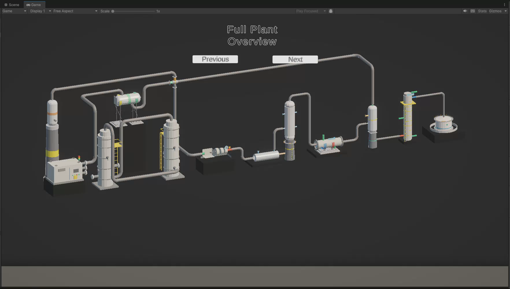
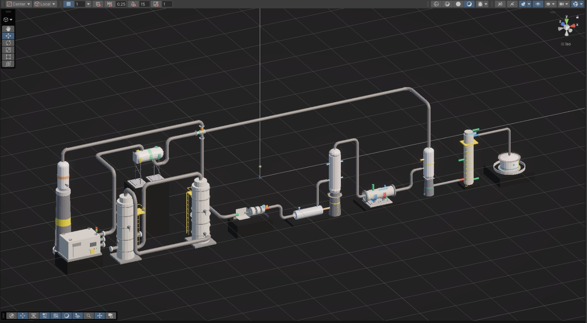
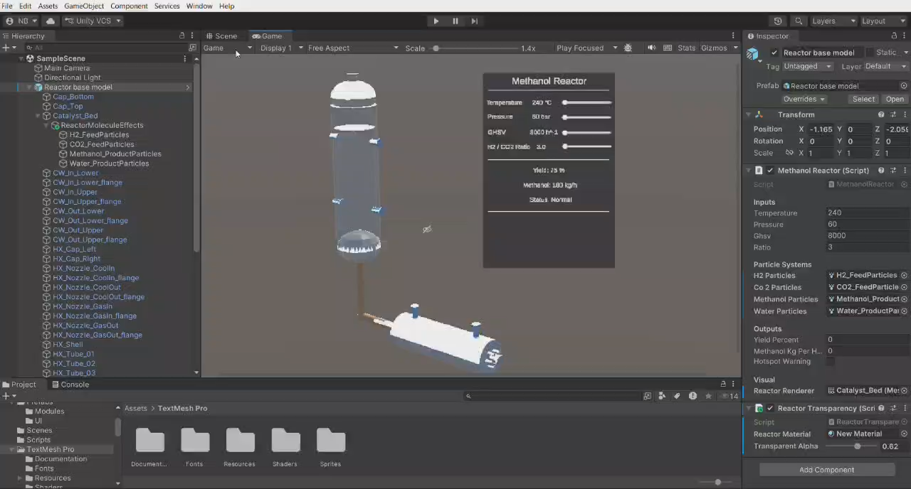
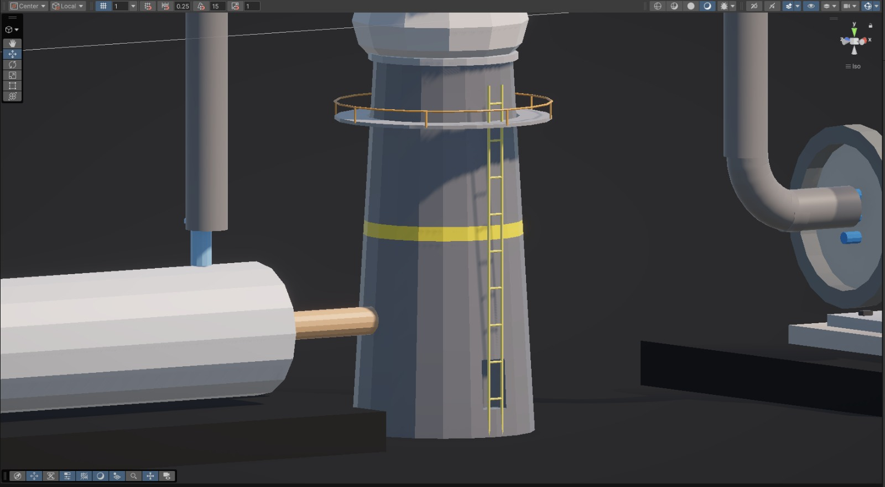
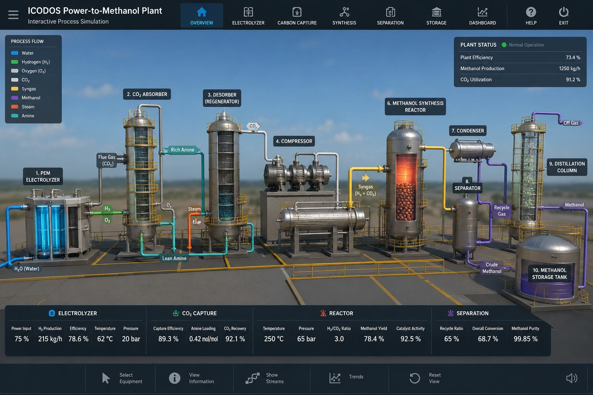

# Progress screenshots

This page collects useful screenshots and reference images from the Sprint 5 slide deck and project material so the repository shows visible development progress without requiring Unity to be opened.

## Current Unity full-plant progress

The current branch contains a Unity 6 full-plant layout for the Power-to-Methanol process. It includes multiple process units, pipe routing, support/platform details, camera navigation, and early flow visualization work.

## Reactor interaction prototype

The reactor prototype demonstrates parameter controls for temperature, pressure, GHSV, and H2/CO2 ratio, with calculated methanol yield and live particle streams.

## Equipment-detail progress

This detail shot shows model work around platform/ladder support structures and equipment connections.

## Target visual direction

The final visual goal is closer to an industrial dashboard: labelled plant units, stream colors, module navigation, live KPIs, process values, and a polished overview interface.

## Feedback-driven next steps

- Make hydrogen and CO2 input sources explicit in the scene and UI.
- Add a visible oxygen byproduct output from the electrolyzer.
- Show gas/liquid percentages and process stream quantities.
- Track process output from one unit into the next.
- Accumulate purified methanol into the storage tank over time.
