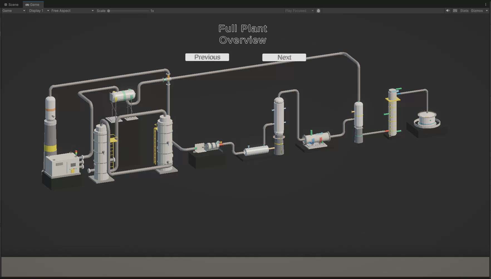
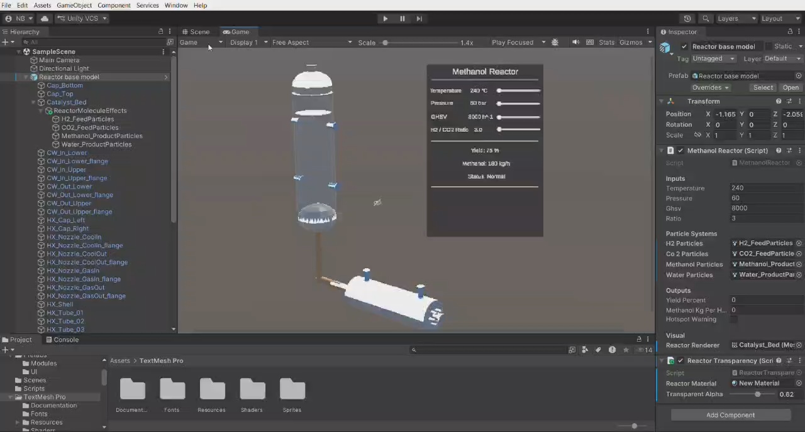
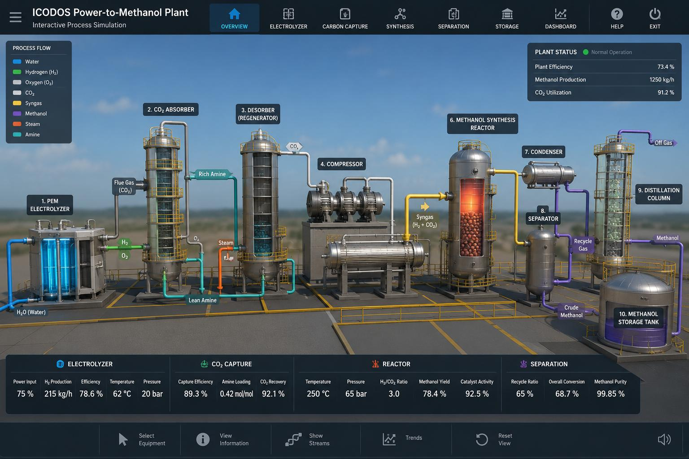

# Progress screenshots

This page collects selected screenshots from the project history so an evaluator can understand the visual implementation without first opening Unity. Images are labelled as either project evidence or external design direction; they are not presented as test results.

## Current Unity full-plant progress

These project screenshots document the Unity 6 full-plant layout, including process units, pipe routing, support/platform details, camera navigation, and flow visualization.

## Reactor interaction prototype

This project screenshot documents an earlier reactor interaction prototype with parameter controls for temperature, pressure, GHSV, and H2/CO2 ratio, calculated methanol yield, and particle streams. The current scene and scripts remain the authoritative implementation.

## Equipment-detail progress

This detail shot shows model work around platform/ladder support structures and equipment connections.

## Target visual direction

This is an external visual-direction reference, not a screenshot of project-authored software. It illustrates the desired industrial-dashboard qualities: labelled units, stream colors, module navigation, KPIs, and process values.

## Evidence limitations

- Screenshots demonstrate visual state only; they do not prove numerical or chemical correctness.
- Reproduce the current application using the steps in [REPRODUCIBILITY_AND_BUILD.md](REPRODUCIBILITY_AND_BUILD.md).
- Use [PROFESSOR_EVALUATION_GUIDE.md](PROFESSOR_EVALUATION_GUIDE.md) for the recommended live evaluation path.
- Record final-submission screenshots and video from the exact submitted commit, and note that commit hash alongside the evidence.
